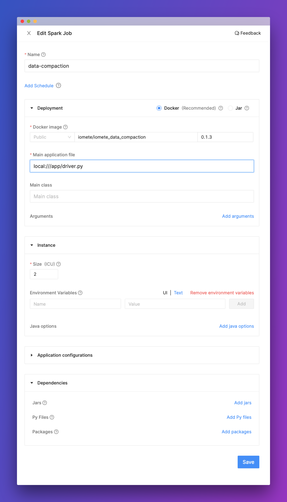

# iomete: Spark Job Template

Over the time iceberg tables could slow down and require to run data compaction to clean up tables.     
**iomete** provides built-in job to run data compactions for each table. This job triggers the next iceberg processes:     
1. ExpireSnapshots [Maintenance - Expire Snapshots](doc:data-compaction#expire-snapshots)    
2. Delete Orphan Files - See [Maintenance - Delete Orphan Files](doc:data-compaction#delete-orphan-files)   
3. Rewrite Data Files - See [Maintenance - Rewrite Data Files](doc:data-compaction#compact-data-files)   
4. Rewrite Manifests - See [Maintenance](doc:data-compaction#rewrite-manifests)    
   
You can use this job/project to enable data compaction. Follow the next steps in iomete Console:     
1. In the left sidebar menu choose `Spark Jobs`    
2. `Create` new job     
3. Fill the form with below values:      
    - Docker Image: `iomete/iomete_data_compaction:0.2.0`    
    - Main application file: `local:///app/driver.py`   
    - Main class: *Leave empty*  
 
Example:


## Using project in local/dev environment

```shell
python3 -m venv .env
source .env/bin/activate

pip install -e ."[dev]"
```

```shell
pytest
```
