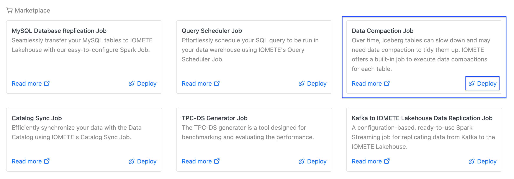
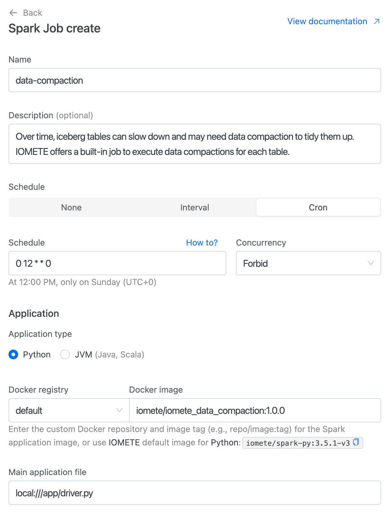
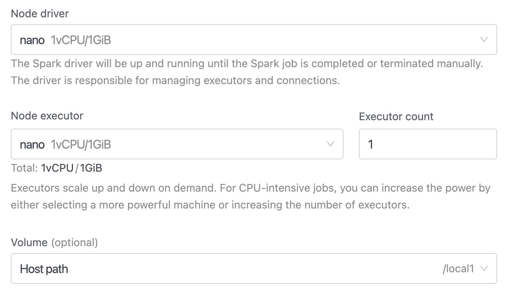
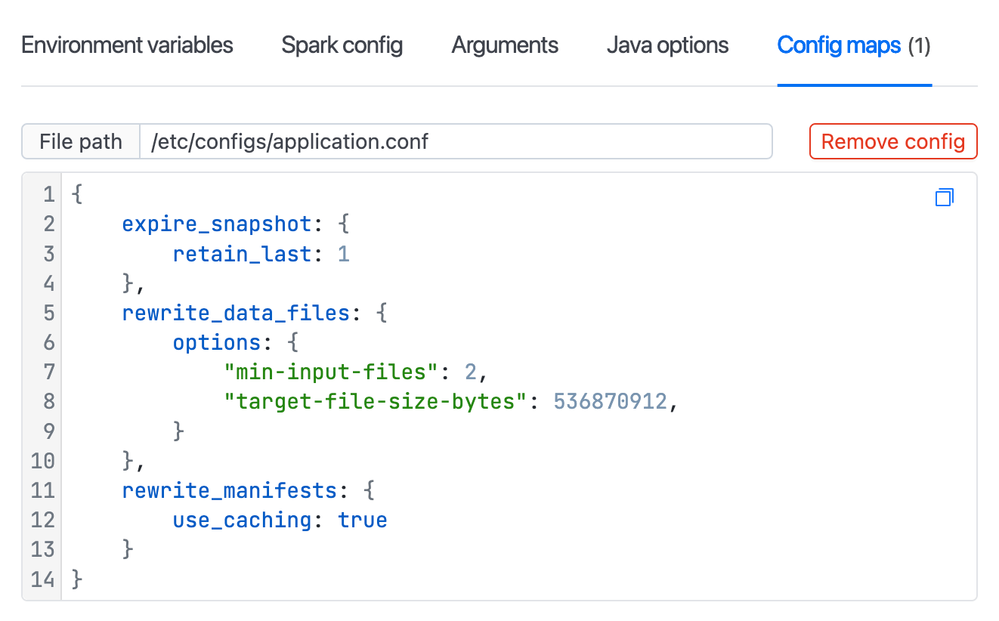

# IOMETE: Spark Job Template

Over the time iceberg tables could slow down and require to run data compaction to clean up tables.  
**IOMETE** provides built-in job to run data compactions for each table. This job triggers the next iceberg processes:

1. ExpireSnapshots [Maintenance - Expire Snapshots](https://iomete.com/resources/reference/iceberg-tables/maintenance#expire-snapshots)
2. Delete Orphan Files - See [Maintenance - Delete Orphan Files](https://iomete.com/resources/reference/iceberg-tables/maintenance#delete-orphan-files)
3. Rewrite Data Files - See [Maintenance - Rewrite Data Files](https://iomete.com/resources/reference/iceberg-tables/maintenance#compact-data-files)
4. Rewrite Manifests - See [Maintenance- Rewrite Manifest Files](https://iomete.com/resources/reference/iceberg-tables/maintenance#rewrite-manifests)

To enable data compaction spark job follow the next steps:

Navigate to the `Job Templates`, then click the `Deploy` button on the **Data Compaction Job** card.

<!-- 1. In the left sidebar menu choose `Spark Jobs`
1. `Create` new job
1. Fill the form with below values:
   - Docker Image: `iomete/iomete_data_compaction:1.0.0`
   - Main application file: `local:///app/driver.py`
   - Main class: _Leave empty_ -->

<kbd></kbd>

<br/>

You will see the job creation page with all inputs filled.

<kbd></kbd>

<br/>

**Instance**

<!-- <kbd></kbd> -->

<kbd></kbd>

<br/>

**Job Configurations**

<!-- <kbd></kbd> -->

<kbd></kbd>

<br/>

## Additional Configurations

You can specify additional configurations

```
{
    // The catalog for which to run compaction
    catalog: "spark_catalog",
    
    // Databases in the catalog for which to run compaction
    // Defaults to empty array
    // In case the input is an empty array then we consider all databases in the provided catalog for compaction 
    databases: [],
    
    // Tables to be included in the compaction run
    // Used as a whitelist. Default to empty array
    // In case the input is an empty array then we consider all tables in the provided database for compaction
    // Expects table in the format <database>.<table>
    table_include: [],
    
    // Tables to be excluded in the compaction run
    // Used as a blacklist. Defaults to empty array
    // Ignored if table_include is non empty
    // Expects table in the format <database>.<table>
    table_exclude: [],
    
    // Configuration for handling tables with G.C. disabled
    // When enabled, the job will check if G.C. is disabled for a table
    // If G.C. is disabled, it will temporarily enable it, run compaction, and then disable it again
    // Defaults to false
    gc_handling: {
        enabled: false
    },
    
    // Default fallback configs for expire_snapshot operation
    expire_snapshot: {
        // Number of ancestor snapshots to preserve regardless of `older_than`
        // DEFAULT: 1
        // retain_last: 1
    },
    
    // Default fallback configs for rewrite_data_files operation
    rewrite_data_files: {
        options: {
            // The minimum number of files that need to be in a file group for it to be considered for compaction. Defaults to 5
            "min-input-files": 2,

            // The output file size that this rewrite strategy will attempt to generate when rewriting files.
            // Defaults to 512MB (536870912 bytes)
            // "target-file-size-bytes": 536870912,

            // The entire rewrite operation is broken down into pieces based on partitioning and within partitions based on size into groups.
            // These sub-units of the rewrite are referred to as file groups.
            // The largest amount of data that should be compacted in a single group is controlled by MAX_FILE_GROUP_SIZE_BYTES.
            // This helps with breaking down the rewriting of very large partitions which may not be rewritable otherwise due to the resource constraints of the cluster.
            // "max-file-group-size-bytes" // default is 1024L * 1024L * 1024L * 100L = 100 GB
        }
    },
    
    // Default fallback configs for rewrite_manifests operation
    rewrite_manifests: {
        // Set to false to avoid memory issues on executors
        // use_caching: true
    },
    
    // Default fallback configs for remove_orphan_files operation
    remove_orphan_files: {
        // Orphan files older than the provided number of days will be removed
        // Defaults to 1
        older_than_days: 1
    },
    
    // Used to override operation configs for specific tables
    table_overrides: {
        // Table for which configs needs to be overridden
        "<database>.<table>": {
            // Operation whose config you want to override
            "<operations>": {
                // Operation level config which needs to be overriden
                "<config_name>" : ""
            }
        }
    }
}
```

## Using project in local/dev environment

```shell
python3.12 -m venv .env
source .env/bin/activate

pip install -e ."[dev]"
```

```shell
pytest
```
